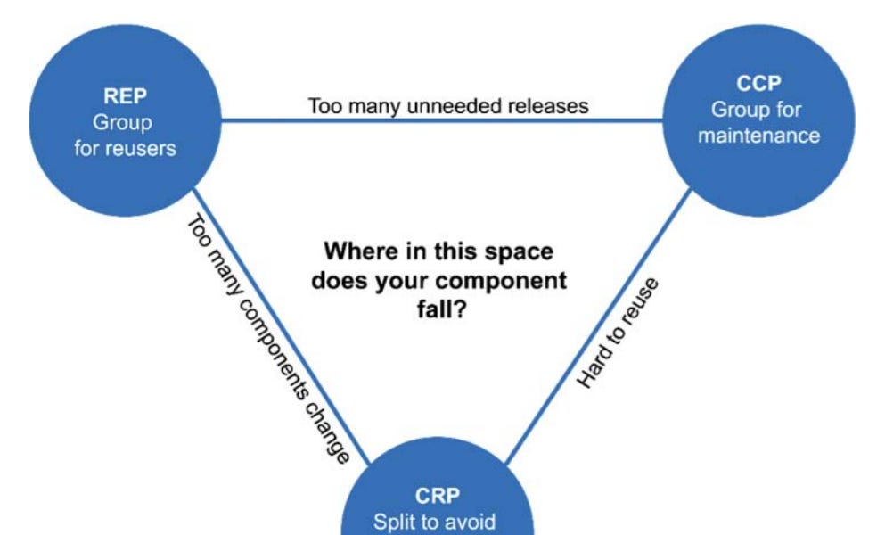

### PART III Design Principles

Chapter 7 SRP: The Single Responsibility Principle

A module should be responsible to one, and only one, user or stakeholder -> A module should be responsible to one, and only one, actor.
SRP is about functions and classes, but it reappears in a  different form at two more levels. At the level of components, it becomes the Common Closure Principle. At the architectural level, it becomes the Axis of Change responsible for the creation of Architectural boundaries.

Chapter 8 OCP: The Open-Closed Principle

A software artifact should be open for extension but closed for modification. The goal is to make the system easy to extend without incurring a high impact of change. This goal is accomplished by partitioning the system into components, and arraging those components into a dependency hierarchy that protects higher-level components from changes in lower-level components.

Chapter 9 LSP: The Liskov Substitution Principle

The LSP, can, and should, be extended to the level of architecture. A simple violation of substitutability, can cause a system's architecture to be polluted with a significant amount of extra mechanisms.

Chapter 10 ISP: The Interface Segregation Principle

Depending on something that carries baggage than you dont need can cause you troubles that you didnt expect.

Chapter 11 DIP: The Dependency Inversion Principle

It tells us that the most flexible systems are those in which source code dependencies refer only to abstractions, not to concretions.
- Dont refer to volatile concrete classes -> refer to abstract interfaces instead
- Dont derive from volatile concrete classes
- Dont override concrete functions
- Never mention the name of anything concrete and volatile

When source code dependencies are inverted against the flow of control it is called Dependency Inversion

### PART IV Component Principles
If the SOLID principles tell us how to arrange the bricks into walls and rooms, then the component principles tell us how to arrange the rooms into buildings. Large software system, like large buildings, are built out of smaller componentes.

Chapter 12 Components

Componentes are the units of deployment. They are the smallest entities that can be deployed as part of a system.
Murphy's law of program size: Programs will grow to fill all available compile and link time. Moore law won vs Murphy's law.

Chapter 13 Component Cohesion

Which classes being in which components?
Principles of component cohesion:
- REP: the Reuse/Release Equivalence Principle
- CCP: the Common Closure Principle
- CRP: the Common Reuse Principle

Explanations:
- REP: modules in a component should make sense together.
- CCP: gather into components those classes that change for the same reasons and at the same times. Separate into different components those classes that change at different times and for different reasons. Is like SRP for components.
- SRP + CCP summarized: gather together those things that change at the same times and for the same reasons. Separate those things that change at different times or for different reasons.
- CRP: dont force users of a component to depend on things they dont need.

Chapter 14 Component Coupling

(Side note: Dependency structures in dynamic languages are much simpler because dependency inversion does not require the declaration and implementation of interfaces. However, the ideas about the direction of component dependencies still apply.)

Three principles that deal with relationships between components:
- The acyclic dependencies principle: allow no cycles in the component dependency graph. Having cycles in the source code component dependency graph brings complications. Break those cycles with:
  - Using Dependency Inversion
  - Creating a new component
- The stable dependencies principle (SDP): depend in the direction of stability aka Depend in the direction of things that are harder to change aka Things that by design should be easy to change should not be depended by things that are hard to change. In an application there must be components that are designed to be volatile because we expect them to change. This components should therefore be easy to change and should not be depended on by something that is hard to change.
Instability is a simple measure that can help us assess if we are complying with the Stable Dependencies Principle.

Instability: I = Fan-out/(Fan-in + Fan-out)
- Fan-in: Incoming dependencies (arrows) to any class within the component.
- Fan-out: Outgoing dependencies (arrows) from any class in the component.
- Instability: I=0 maximally stable component. I=1 maximally unstable component.

The SDP says that the I metric should decrease in the direction of dependency.

- The stable abstractions principle (SAP): High-level logic and policies should be placed into stable components (I=0) and they should be depended on by other classes.
However, despite this, we want to be able to preserve some leeway to be able to change them if needed. To do this, we can create abstract classes and interfaces within the high-level component and have all other components depend on these abstractions.
This will result in a component that has mix:
Abstracts classes and interfaces other components depend on.
Concrete classes that implement those abstractions and that are easier to change because no one depends on them.
2 more metrics are defined: Abstractness and Distance from the Main Sequence. These provide a framework for measuring how compliant components are against the SDP and SAP.
