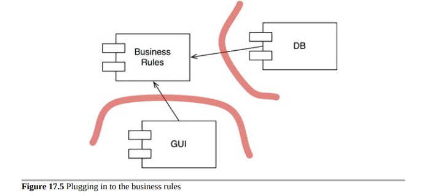
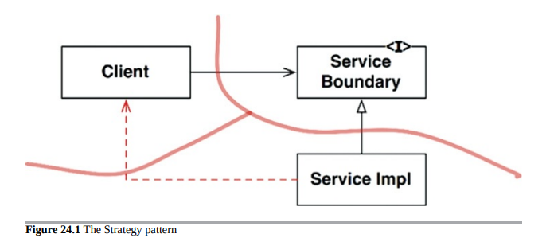
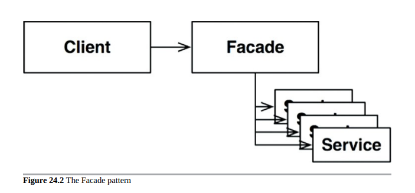

# Part V - Architecture

## Chapter 15 What is Architecture?
The architecture of a software is the composition, shape, communication mechanisms between the components that make the software. The purpose is to facilitate development, deployment, operation and maintenance, optimising to minimize lifetime maintenance cost and maximize programmer productivity.

The strategy is to leave as many options open as possible, for as long as possible.
The above entails that the primary role of architecture is NOT correct behaviour of the system. Correct behaviour is a critical yet-secondary priority.

There are many systems out there that work correctly but that are very hard to maintain.

On a very high-level, software systems can be divided into 2 elements: policies and details.

Policies: business rules and procedures.
Details: things that are necessary for humans and other systems to communicate with the policy but that not impact the policy at all (e.g. They include IO devices, databases, web systems, servers, frameworks, communication protocols, and so forth).
The goal of the architect is to create a shape for the software that recognizes the policies as the main elements and keeping the details irrelevant to them.

Some examples of leaving the options open:

Selection of a DB does not need to happen in the early days of development. The policy should not care which kind of DB is used (or it may even use flat files).
This even goes as far as the query language and even the schema are technical details that have nothing to do with the policies (business rules).
It is not necessary to choose the web server early. The web is a delivery mechanism that policy should be unaware of. Furthermore, the policy could be used in non-web systems without change.
REST, GraphQL, SOA, micro-services. All of these things are interfaces to the outside world that the high-level policy is not concerned about. This decisions can be deferred.
It is not necessary to adopt a dependency injection framework early in development, because the high-level policy should not care how dependencies are resolved.

## Chapter 16 Independence
Any organization  that designs a system will produce a design whose structure is a copy of the organization's communication structure.
Decoupling so that the architect can employ the Single Responsibility Principle and the Common Closure Principle to separate those things that change for different reasons, and to collect thhose things that change for the same reasons--given the context of the intent of the system.

## Chapter 17 Boundaries: Drawing Lines
You draw lines between things that matter and things that don't. The GUI doesn't matter to the business rules, so there should be a line between them. The database doesn't matter to the GUI, so there should be a line between them.The database doesn't matter to the business rules, so there should be a line between them.

The history of software development technology is the story of how to conveniently create plugins to establish a scalable and maintainable system architecture. The core business rules are kept separate from, and independent of, those components that are either optional or that can be implemented in many different forms.

## Chapter 18 Boundary Anatomy
The architecture of a system is defined by a set of software components and the boundaries that separate them. Those boundaries come in many different forms.

What is boundary crossing?
In software, boundaries are crossed when a function on one side of the boundary calls a function on the other side of the boundary.

Depending on the decoupling mode, this call can be an inexpensive call to another function in the same project, a call to a function that lives in a packaged jar or gem that is imported into our project, a call via inter-process communication (e.g sockets or shared memory) or a full network call.

## Chapter 19 Policy and Level
Clean architecture's fundamental idea of higher-level policies should not depend on low-level details is supported on a notion of component level that we have not explored formally yet.

A possible definition of a component level is the minimum number of steps needed to reach either the input and the output. The larger the number of steps, the higher the level.

Why is this notion of level important?

Higher-level policies—those that are farthest from the inputs and outputs—tend to change less frequently, and for more important reasons, than lower-level policies. Lower-level policies—those that are closest to the inputs and outputs—tend to change frequently, and with more urgency, but for less important reasons.

## Chapter 20 Business Rules
To divide our app into business rules (policies) and plugins, we better know what business rules are.

There are several types of business rules. But the simple definition is that a business rule is a procedure that helps the business make or save money.

### Entities (Application-independent Business Rules)
There are procedures that would exist in the business even if they were not automated and had to be executed manually. We call these procedures Critical Business Rules.

e.g. In a Bank, Loans have procedures to calculate interests and make payments.
Critical Business Rules need some data to work with. This data would also exist even if the system was not automated. We call these Critical Business Data.

e.g. In a Bank, Loan procedures need a loan balance, interest rate, etc.

### Use Cases (Application-specific Business Rules)
They are business rules that make or save money by defining the way the automated system operates. They wouldn't exist if the business operated in a manual environment.

For example, the bank application may not allow the bank clerk to proceed to the bank payment estimation screen, until the client's contact information and credit score have been gathered and validated.

####Requests and Response Models
Since we want the use case to get input data and return output without coupling them to any particular type of I/O device (like the web or the DB), we need to introduce simple (non-web related) Request and Response data structures. These structures should not depend on anything:

They should not know about the web or the DB.
They should not know about the framework.
They should not contain references to Entity objects.
Despite probably sharing data with Entity objects, the purpose of these two objects is very different and they will change for very different reasons. Therefore this is accidental duplication and it is better to keep them separate.
Not complying with the above will result in your use cases indirectly depending on things like the web or the framework.
## Chapter 21 Screaming Architecture
Software architectures are structures that support the use cases of the system. As such, when someone takes a look at the top-level directory of a project, it should be evident what the use cases of the system are (i.e. what it is about). All rails applications look the same, thats a problem. 

The following things are often mistaken as an architecture, but they are not:

- The Web: The web is a delivery mechanism (an IO device). Your architecture should treat the fact that it is delivered via the web as a detail.
- Frameworks: frameworks and the structures they impose are not an architecture. Frameworks authors and their community tend to be true believers of them and assume a "let-the-framework-do-everything" position. This is not the position we want to take. Frameworks help, but that comes at a cost that may not be worth paying. Preserve the use case emphasis of your architecture and develop a strategy in which you can use a framework without it taking over your architecture.

## Chapter 22 The Clean Architecture
Once we know how to separate components by setting boundaries, we can organize these components into layers. Layers are concentric and represent how fundamental (or high-level) components are. At the core, we have the high-level policies, i.e. stable and abstract components encapsulating our business rules. On the outer ring, we have the details, for example, unstable and concrete GUI’s.

Source-level dependencies should be organized according to the dependency rule: outer layers should depend on inner layers (at the source-level), and not vice versa. We can remove violations of the dependency rule by setting boundaries.

We can identify four main layers, although the number may vary:

- Entities: objects containing critical business logic. For example, a bank could establish that no loans are granted to customers not satisfying some credit score requirements. Entities may be shared across apps in the same enterprise.
- Use-cases: app-specific business rules. For example, the sequence of screens to execute a bank transfer.
- Interface adapters: Gateways, presenters and controllers. For example, this layer will contain the MVC architecture of the GUI and also objects that transform data between the format of the database and the use-cases.
- Frameworks and drivers: web frameworks, database, the view of MV

#### Crossing Boundaries
The diagram above shows an example on how to cross the boundaries. Note the usage of Dependency Inversion to ensure that source code dependencies always point to higher-level layers. Also note that the source code dependency direction is independent from the flow of control (aka flow of execution) direction.

##### Which Data Crosses the Boundaries
Data crosses boundaries in simple data structures. All of these forms are acceptable:

Structs.
- Simple data transfer objects (e.g. value objects).
- The data can simple be the arguments in function calls.
- Data packed into hashmaps (aka Ruby hashes).
- The data should always be in the form that is most convenient for the inner circle (higher-level layer).

Common violations of these are:

- Passing Entity objects
- Having the DB framework pass some sort of automated "row structure" created as a result of a query into the use case (e.g. pass in active record objects into the use cases).

## Chapter 23 Presenters and Humble Objects

### The Humble Object Pattern
This pattern helps us identify and protect architectural boundaries. The Clean architecture extensively uses the Humble object pattern to do just this.

Starting with code that is very hard to test (like a GUI), the pattern makes the thing that is hard to test as dumb as possible (i.e. humble) by pulling out things that are easy to test into a separate class.

For example, a GUI can be split into a presenter and a view (a form of Humble object) that is very dumb. This makes it very easy to test all the GUI content via the presenter without actually having to render the GUI. The view is so dumb that it is not even tested automatically.

### More on Presenters and View Models and Views
Presenters format everything and dump the result of that formatting into a View Model data structure that contains Strings, boolean flags and enums.

These are some things that the Presenter places into the View Model: stringified dates, stringified currencies, currency color, labels for buttons, if buttons should be disabled or not, menu items, names for every radio button, check box and text fields, tables, etc...

The View only loads data from the view model.

## Chapter 24 Partial Boundaries
Fully-fledged strict architectural boundaries result the creation of a lot of interfaces and data structure classes to maintain. Sometimes, this can be judged as too complex or too expensive to build in light of the specifics of the project. See the next chapter for more information of when to use these.

For those cases, we might want to introduce a Partial Boundary. A partial boundary allows us to reduce the complexity (in terms of number of files) but ideally still leaves room to upgrade to a strict boundary if needed.

Note that all partial boundaries are open to degradation if developers are not disciplined. Therefore, there might be some work required to upgrade it to a strict boundary.

Note that as a general rule of thumb, code from outer layers should be compromised with partial boundaries first. 
Ways to introduce partial boundaries:

### One-dimensional boundaries

It should be clear that this sets the stage for a future architectural boundary. The necessary dependency inversion is in place in an attempt to isolate the Client from the ServiceImpl. It should also be clear that the separation can degrade pretty rapidly, as shown by the nasty dotted arrow in the diagram.

### Facades

An even simpler boundary is the Facade pattern. In this case, even the dependency inversion is sacrificed. The boundary is simply defined by the Facade class, which lists all the services as methods, and deploys the service calls to classes that the client is not supposed to access.

## Chapter 25 Layers and Boundaries
This chapter shows an example of how Clean Architecture thinking can be applied to a simple game that has increasingly complex requirements and how that leads to discovery of potential boundaries that didn't look apparent.

The points being made here are:

- Even for simple programs, we can come up with many architectural boundaries everywhere if we try hard enough.
- Software architecture has an unfortunate inherent trade-off between the cost of implementing boundaries VS the cost of ignoring them.
- Implementing a strict boundary when the software is simple and the boundary could be ignored is costly and leads to over-engineering.
- Implementing a boundary after we have ignored one is costly and risky. Also, permanently ignoring one where it is needed makes the project costly to maintain and change.
- So what do we do? We weigh the costs and risks of implementing vs ignoring to determine where architectural boundaries lie, which should be strict, which can be partial and which can be ignored.
- Note that this is not one time decision. As the project evolves, we watch what things are causing friction in the development and maintainability and could use a boundary.
- Our goal is to implement the boundary at the point where the cost of implementation is less than the cost of ignoring.

## Chapter 26 The Main Component
In every system, there is at least one component that creates, coordinates, and oversees the others. This component is called by the author as Main.

Under the Clean Architecture, Main is the outer-most layer and is the lowest-level plugin to the application. This layer is not depicted in the diagram shown in Chapter 22 - The Clean Architecture.

The job of Main is:

- Create all Factories, Strategies and other global facilities, then hand over control to the high-level portions of the system.
- The dependency injection framework should inject dependencies into Main. Then Main should distribute those dependencies just using code (without a framework).

Since main is a plugin, it is possible to have many Main components, one for each configuration of your app. For example:

- Main for Dev another for Test and another for Production.
- One Main for every deployment region of your business.

## Chapter 27 Services: Great and Small

Service-oriented "architectures" and microservices have become popular recently due to 2 reasons:

- Services seem to be strongly decoupled from each other. As we shall see, this is only partially true.
- Services appear to support independence of development and deployment. Again, as we shall see, this is only partially true.

### Are Services an Architecture?
Services do not define the architecture. Services are really a Decoupling Mode, not an architecture in itself. 

### Are the Benefits of Services Real?

#### The Decoupling Hype
One of the supposed benefits of breaking a system into service is its strict decoupling which enforces no shared memory and well defined interfaces between services.

This is only partially true:

Separate services can still be coupled by the structure of the data they pass to each other. If a field is added to a record in one place, all other services get that data passed in need to change. Also, the meaning of each data field in each service needs to be the same (conceptual coupling).
Services that share a database are coupled by both the schema and the "shared memory" that the data represents.
The benefits of strictness of network interfaces are true, but this is also true for function calls that have been given the correct visibility attributes.

#### The Independence of Development and Deployment Hype
The points above also mean that the idea of independent development and deployment are also only partially true. For example, if services A and B share the database or the data format that is passed, when Service A changes the database schema, then Service B needs to change and the deployment needs to be coordinated.

## Chapter 28 The Test Boundary
Tests are part of the architecture of a system. The good news is that from the point of view of the architecture, unit tests, integration tests, behaviour tests...etc... all look the same. They all are detailed, low-level components that always depend inward to the code being tested. In a way, tests are the outermost circle of the clean architecture.

### Design for Testability
Testing should be part of the considerations when designing a system. Not considering tests as part of the design is a mistake that leads to fragile tests that are expensive to maintain and often end up getting discarded.

Fragile test problems occur when tests depend on volatile things (like the GUI) to test stable things. For example, writing GUI driven tests to test business rules can cause many use case tests to break when unrelated changes in the GUI happen.

To avoid these problems, design the system and the tests so that business rules can be tested without using the GUI (or other volatile things). The way the author recommends to do this is to create a testing API that has "superpowers". These super powers include avoiding security constraints, bypassing expensive resources such as databases and allow developers to force the system into particular testable states.

## Chapter 29 Clean Embedded Architecture

> It is not uncommon for embedded software to be denied a potentially
> long life due to being infected with dependencies on hardware.

Firmware is software that is tightly coupled to the hardware it runs on. This coupling results in the need to re-write when the hardware changes.

Hardware changes at a very fast pace. To shield businesses from this, firmware engineers should be writing more *software* (code that has been isolated from the hardware it runs on) and less *firmware*.

### App-titude Test: The problem with just making it work

A general software good practice is:

> 1. “First make it work.” You are out of business if it doesn't work.
> 2. “Then make it right.” Refactor the code so that you and others can
>    understand it and evolve it as needs change or are better
>    understood.
> 3. “Then make it fast.” Refactor the code for “needed” performance.

Many engineers stop at "making it work" (aka the app-titude test) and never go beyond that.In embedded software in particular, often 1 and 3 are done together and 2 is never considered.

### The Target-Hardware Bottleneck Problem

> There are many special concerns that embedded developers have to deal
> with that non-embedded developers do not—for example, limited memory
> space, real-time constraints and deadlines, limited IO, unconventional
> user interfaces, and sensors and connections to the real world.

Yes, embedded software has to run in special constrained hardware. However, embedded software *development* is not SO special; the principles of clean architecture still apply.

In embedded systems, you know you have problems when you can only test your code on the target hardware (as opposed to being able to test the business rules of your code independent of the hardware). This is known as the *target hardware bottleneck problem*. **A clean embedded architecture is a testable embedded architecture.**

