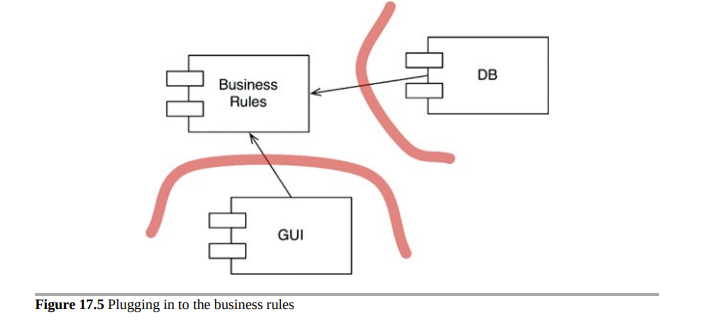

# Part V - Architecture

## Chapter 15 What is Architecture?
The architecture of a software is the composition, shape, communication mechanisms between the components that make the software. The purpose is to facilitate development, deployment, operation and maintenance, optimising to minimize lifetime maintenance cost and maximize programmer productivity.

The strategy is to leave as many options open as possible, for as long as possible.
The above entails that the primary role of architecture is NOT correct behaviour of the system. Correct behaviour is a critical yet-secondary priority.

There are many systems out there that work correctly but that are very hard to maintain.

On a very high-level, software systems can be divided into 2 elements: policies and details.

Policies: business rules and procedures.
Details: things that are necessary for humans and other systems to communicate with the policy but that not impact the policy at all (e.g. They include IO devices, databases, web systems, servers, frameworks, communication protocols, and so forth).
The goal of the architect is to create a shape for the software that recognizes the policies as the main elements and keeping the details irrelevant to them.

Some examples of leaving the options open:

Selection of a DB does not need to happen in the early days of development. The policy should not care which kind of DB is used (or it may even use flat files).
This even goes as far as the query language and even the schema are technical details that have nothing to do with the policies (business rules).
It is not necessary to choose the web server early. The web is a delivery mechanism that policy should be unaware of. Furthermore, the policy could be used in non-web systems without change.
REST, GraphQL, SOA, micro-services. All of these things are interfaces to the outside world that the high-level policy is not concerned about. This decisions can be deferred.
It is not necessary to adopt a dependency injection framework early in development, because the high-level policy should not care how dependencies are resolved.

## Chapter 16 Independence
Any organization  that designs a system will produce a design whose structure is a copy of the organization's communication structure.
Decoupling so that the architect can employ the Single Responsibility Principle and the Common Closure Principle to separate those things that change for different reasons, and to collect thhose things that change for the same reasons--given the context of the intent of the system.

## Chapter 17 Boundaries: Drawing Lines
You draw lines between things that matter and things that don't. The GUI doesn't matter to the business rules, so there should be a line between them. The database doesn't matter to the GUI, so there should be a line between them.The database doesn't matter to the business rules, so there should be a line between them.

The history of software development technology is the story of how to conveniently create plugins to establish a scalable and maintainable system architecture. The core business rules are kept separate from, and independent of, those components that are either optional or that can be implemented in many different forms.

## Chapter 18 Boundary Anatomy
The architecture of a system is defined by a set of software components and the boundaries that separate them. Those boundaries come in many different forms.

What is boundary crossing?
In software, boundaries are crossed when a function on one side of the boundary calls a function on the other side of the boundary.

Depending on the decoupling mode, this call can be an inexpensive call to another function in the same project, a call to a function that lives in a packaged jar or gem that is imported into our project, a call via inter-process communication (e.g sockets or shared memory) or a full network call.

## Chapter 19 Policy and Level
Clean architecture's fundamental idea of higher-level policies should not depend on low-level details is supported on a notion of component level that we have not explored formally yet.

A possible definition of a component level is the minimum number of steps needed to reach either the input and the output. The larger the number of steps, the higher the level.

Why is this notion of level important?

Higher-level policies—those that are farthest from the inputs and outputs—tend to change less frequently, and for more important reasons, than lower-level policies. Lower-level policies—those that are closest to the inputs and outputs—tend to change frequently, and with more urgency, but for less important reasons.

## Chapter 20 Business Rules
To divide our app into business rules (policies) and plugins, we better know what business rules are.

There are several types of business rules. But the simple definition is that a business rule is a procedure that helps the business make or save money.

### Entities (Application-independent Business Rules)
There are procedures that would exist in the business even if they were not automated and had to be executed manually. We call these procedures Critical Business Rules.

e.g. In a Bank, Loans have procedures to calculate interests and make payments.
Critical Business Rules need some data to work with. This data would also exist even if the system was not automated. We call these Critical Business Data.

e.g. In a Bank, Loan procedures need a loan balance, interest rate, etc.

### Use Cases (Application-specific Business Rules)
They are business rules that make or save money by defining the way the automated system operates. They wouldn't exist if the business operated in a manual environment.

For example, the bank application may not allow the bank clerk to proceed to the bank payment estimation screen, until the client's contact information and credit score have been gathered and validated.

####Requests and Response Models
Since we want the use case to get input data and return output without coupling them to any particular type of I/O device (like the web or the DB), we need to introduce simple (non-web related) Request and Response data structures. These structures should not depend on anything:

They should not know about the web or the DB.
They should not know about the framework.
They should not contain references to Entity objects.
Despite probably sharing data with Entity objects, the purpose of these two objects is very different and they will change for very different reasons. Therefore this is accidental duplication and it is better to keep them separate.
Not complying with the above will result in your use cases indirectly depending on things like the web or the framework.
## Chapter 21 Screaming Architecture
Software architectures are structures that support the use cases of the system. As such, when someone takes a look at the top-level directory of a project, it should be evident what the use cases of the system are (i.e. what it is about). All rails applications look the same, thats a problem. 

The following things are often mistaken as an architecture, but they are not:

- The Web: The web is a delivery mechanism (an IO device). Your architecture should treat the fact that it is delivered via the web as a detail.
- Frameworks: frameworks and the structures they impose are not an architecture. Frameworks authors and their community tend to be true believers of them and assume a "let-the-framework-do-everything" position. This is not the position we want to take. Frameworks help, but that comes at a cost that may not be worth paying. Preserve the use case emphasis of your architecture and develop a strategy in which you can use a framework without it taking over your architecture.

## Chapter 22 The Clean Architecture
## Chapter 23 Presenters and Humble Objects
## Chapter 24 Partial Boundaries
## Chapter 25 Layers and Boundaries
## Chapter 26 The Main Component
## Chapter 27 Services: Great and Small
## Chapter 28 The Test Boundary
## Chapter 29 Clean Embedded Architecture

