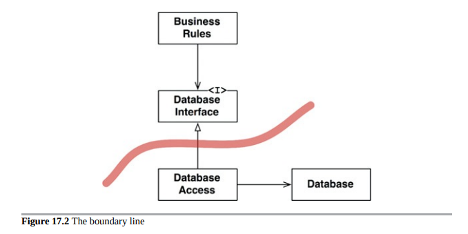

# Part V - Architecture

## Chapter 15 What is Architecture?
The architecture of a software is the composition, shape, communication mechanisms between the components that make the software. The purpose is to facilitate development, deployment, operation and maintenance, optimising to minimize lifetime maintenance cost and maximize programmer productivity.

The strategy is to leave as many options open as possible, for as long as possible.
The above entails that the primary role of architecture is NOT correct behaviour of the system. Correct behaviour is a critical yet-secondary priority.

There are many systems out there that work correctly but that are very hard to maintain.

On a very high-level, software systems can be divided into 2 elements: policies and details.

Policies: business rules and procedures.
Details: things that are necessary for humans and other systems to communicate with the policy but that not impact the policy at all (e.g. They include IO devices, databases, web systems, servers, frameworks, communication protocols, and so forth).
The goal of the architect is to create a shape for the software that recognizes the policies as the main elements and keeping the details irrelevant to them.

Some examples of leaving the options open:

Selection of a DB does not need to happen in the early days of development. The policy should not care which kind of DB is used (or it may even use flat files).
This even goes as far as the query language and even the schema are technical details that have nothing to do with the policies (business rules).
It is not necessary to choose the web server early. The web is a delivery mechanism that policy should be unaware of. Furthermore, the policy could be used in non-web systems without change.
REST, GraphQL, SOA, micro-services. All of these things are interfaces to the outside world that the high-level policy is not concerned about. This decisions can be deferred.
It is not necessary to adopt a dependency injection framework early in development, because the high-level policy should not care how dependencies are resolved.

## Chapter 16 Independence
Any organization  that designs a system will produce a design whose structure is a copy of the organization's communication structure.
Decoupling so that the architect can employ the Single Responsibility Principle and the Common Closure Principle to separate those things that change for different reasons, and to collect thhose things that change for the same reasons--given the context of the intent of the system.

## Chapter 17 Boundaries: Drawing Lines
You draw lines between things that matter and things that don't. The GUI doesn't matter to the business rules, so there should be a line between them. The database doesn't matter to the GUI, so there should be a line between them.The database doesn't matter to the business rules, so there should be a line between them.

## Chapter 18 Boundary Anatomy
## Chapter 19 Policy and Level
## Chapter 20 Business Rules
## Chapter 21 Screaming Architecture
## Chapter 22 The Clean Architecture
## Chapter 23 Presenters and Humble Objects
## Chapter 24 Partial Boundaries
## Chapter 25 Layers and Boundaries
## Chapter 26 The Main Component
## Chapter 27 Services: Great and Small
## Chapter 28 The Test Boundary
## Chapter 29 Clean Embedded Architecture

