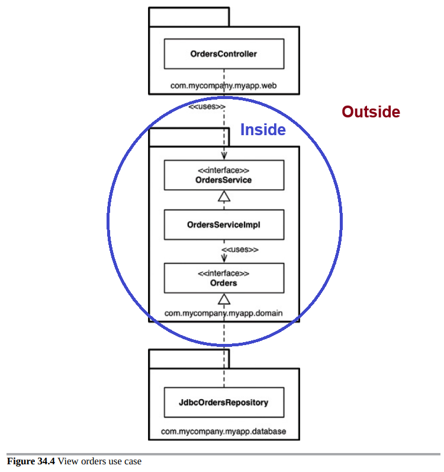

# Part VI - Details

## Chapter 30 The Database is a Detail
The data model is highly significant to your architecture and most likely is part of your entities. However, the database tool to access your data is a low level detail that is not an architectural element.

### Relational Databases
Relational databases are elegant and mathematically sound technology. However, while relational tables represent a convenient form of data storage and access, there is nothing architecturally significant about arranging data in rows within tables.

Your use cases should not know or care about the way data is stored.
Knowledge of the tabular structure should be restricted to the data access (aka gateways) layer of the clean architecture.
Many frameworks allow database rows and tables to be passed around the system. This is an architectural error that couples use cases, business rules and even the UI to the structure of the data.
Your use cases should depend on your data model, which most likely is a set of rich objects or data structures like linked lists, trees, hash tables, queues, etc. We almost always map the tabular data into other data structures and very rarely work with rows and tables directly on our use cases or business rules.

### What about performance?
Performance is architecturally significant, but it can be entirely encapsulated and separated from the business rules. Getting data in an out of the data store quickly should be handled outside of the business rules in the lower level data access mechanisms.

## Chapter 31 The Web is a Detail
The philosophical bottom line is the GUI is a detail and the web is a GUI. The web is nothing more than an IO device and hence we should try to isolate it from our business logic.

The practical bottom line is that with ultra-rich web UIs that constantly communicate with the servers, aiming for full device independence in all interactions might be unpractical.

A more practical approach is to reason about the interactions between the GUI and the application as if they were divided into two types:

- Small and constant interactions that happen to build up and complete the set of inputs required to run a use case (e.g. drag and drops to sort things, async loading of drop down data, autocompletes)
- Business critical interactions that happen when the complete input data is sent to a use case, the use cases processes the data and returns an output to the GUI.

Trying to achieve device independence for the first type of interactions is probably unpractical and not business critical. On the other hand, it is easier to do so for the second type and luckily our precious business logic (use cases) can be separated from the GUI in this case.

## Chapter 32 Frameworks are Details
Frameworks are powerful and useful; but they are not architectures.

Use frameworks but try not to marry them. If you marry into a framework, make sure that it is a conscious decision and that the team understands that it will be part of you application forever (until you re-write it).

### An asymmetric marriage
You relationships with frameworks is asymmetric in nature: as engineers we make an enormous commitment to them by coupling our business logic to the framework. But, the framework maintainers don't know us and probably won't steer the framework to solve our problems if problems happen.

#### The risks of marrying into a framework
- Frameworks architecture is often not very clean and tend to violate the dependency rule. Your project should follow the structure that your code needs, not the one the framework needs.
- Frameworks often require you to tightly couple your business logic code to them by subclassing or mixing in framework classes or modules into your Entities and Use Cases. Once you do that, the framework is not coming back out of your app.
- The framework might help you with early development of features. But once your product matures and outgrows the framework, you will start fighting it.
- The framework might evolve into a direction that you don't find useful, it might get abandoned or you might want to switch. Once you couple to it, you are stuck upgrading to new versions even if you don't need them.

### Use frameworks but do not marry them
Treat frameworks as details and limit its use to the outer layers of the clean architecture. That is, don't let them into your Use Cases or Entities.

If you need to let them in, don't derive a framework class, derive a proxy instead that you control and that acts as a plugin to the business rules.

## Chapter 33 Case Study: Video Sales
A case study that shows how to apply architectural thinking to an application.

### Step 1: Use Case Analysis: Identify the actors and their use cases
- Each actor represents a group of people that will drive changes into the system (they are reasons why the systems needs to change).
- Partition the system such that changes for one actor does not impact other actors.

### Step 2: Create a Preliminary Component Architecture

In this case, the Gateways are not divided by use case, meaning that this architecture does not follow the strict vertical and horizontal layer division presented before.

This an example of a partial boundary trade-off, made to reduce the project complexity. Note that the rest of the components do maintain vertical and horizontal layering and that the compromise was made on one of the outer layers (not on the use cases or entities).

### Step 3: Check the Dependency Management
Make sure your preliminary design follows the Dependency Rule:

- Arrows point towards the higher-level components.
- All arrows cross boundaries in the same direction.

## Chapter 34 The Missing Chapter
All the advice so far will make you a better engineer. But, the devil is in the details, so lets take some time to see how some of this ideas are implemented.

### 4 Ways to organize code

#### 1. Package by layer

- Separate code by what it does form the technical perspective, for example models, views and controllers.
- This is a horizontal-only layering approach. Ideally layers only depend on the next adjacent layer.
In Java, layers are often implemented as packages.
- Pros: simple way to get started. Easy to understand.
- Cons:
  - As software becomes more complex, the pre-established amount of layers is not sufficient. Not all features require all layers.
  - The project structure does not scream what the project does.
  - It is easy for developers to "skip a layer" and still maintain the rule of "all dependencies should point downward". For example, a controller may import a repository directly skipping the interactors. "Skipping a layer" can quickly degrade into big balls of mud.

#### 2. Package by feature
- Vertical slicing based on related features, domain concepts or aggregate roots.
- Pros:
  - The project structure screams architecture.
  - It is easier to find all the code you need to touch if a use case / feature changes, since all is grouped together.
- Cons:
  - It is often considered a step up from "package by layer", but both are sub-optimal. We can do better.

#### 3. Ports and adapters
- Architectures like "ports and adapters", "hexagonal architecture", "boundaries, controllers, entities" all have this organisation strategy.
- Roughly speaking, all bits of code on a project can be categorized as being "inside" if they are part of the domain business rules, or "outside" if the are infrastructure or details.
- Things "inside" are independent from technical implementation details such as frameworks and databases.
- Things "outside" depend on things "inside", not the other way around.
- Pros:
  - Good encapsulation that naturally follows the horizontal and vertical layering.
- Cons:
  - Will lead to a large number of packages.
  - It is still technically possible for the OrdersController to import the Orders<I> skipping the OrdersService<I> (more on this on the next section).

#### 4. Package by component

This is Simon Brown's preference on how to organize code It uses a slightly different definition of "component" than Uncle Bob's.

- For Uncle Bob, a "component" is a fine grained grouping of functionality that, if needed could be packaged into a single jar file each. The actual division of components into packages is not prescribed by Uncle Bob and left up to the engineers to figure out what makes sense for their application.
- For Simon, "components" are coarser and the concept is much more related to an actual suggested Java package division strategy for code organisation an the usage of package visibility modifiers to enforce the architecture and encapsulation.

Simon's "package by component" does not contradict the ideas from Clean Architecture. His idea represent a practical implementation of how to divide code into Java packages.

The problems he is trying to solve are:

- In the "package by layer", "package by feature" and "ports and adapters" packaging strategies there is nothing stopping a developer from "skipping a layer" and doing something like importing the OrdersRepository<I> in the OrdersController.
- To avoid problems like this to happen, teams often rely on discipline (but we know how that goes) or extra static analysis tools to detect when the intended architecture has been violated. He argues that the best approach to enforce this architectural principle is via the compiler.
Static analysis tools work, but sometimes extend the feedback cycle too much.

##### Trade-offs
Compared to "ports and adapters", trade-offs a little bit of the strictness in the horizontal layering for having less packages and making it impossible to import the wrong thing from the OrdersController.

- Less packages = easier to understand and deploy. All the code needed to make the OrdersComponent work travels together.
- Cheat-proof: It is impossible to import the OrdersRepository<I> from the controller.
- Swapping with arbitrary implementations of the OrdersRepository<I> is no longer possible, although the code still maintains the proper separation of concerns internally, so it shouldn't be hard.
